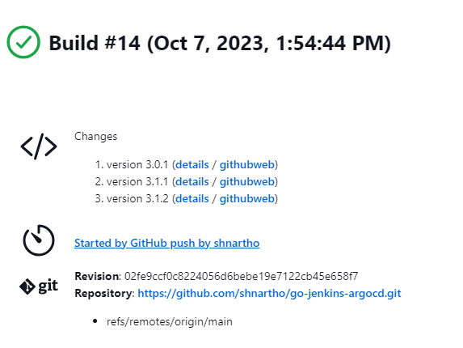

## A straightforward website built with Go, backed by a Jenkins and ArgoCD-managed CI/CD pipeline.✌️

### 🔰 Overview 

#### 🟢 The website is running in localhost. To update and push the changes in the server, I have Jenkins for CI and argoCD for CD.

#### 🟢 Here I prepared the Jenkins server for CI

#### 🟢 Let's update the code and push it to the git repository

#### 🟢 The code repository has been updated

#### 🟢 Update got triggered by the GitHub webhook

#### 🟢 Jenkins pulling the updated code repository and executing shell commands

#### 🟢 Jenkins workspace after pulling the latest repo

#### 🟢 The website is running on Jenkins server port 8091

#### 🟢 The website functionalities are working as expected

### 🖥️ Servers Setup 
1. EC2: To connect using aws ec2 instances, first check if "etc/ssh/sshd_config -> PasswordAuthentication yes", incase it is set to no then change it to yes otherwise using putty you cant connet to the ec2 instances. 
2. Jenkins: Install java runtime environment. For Jenkins installing follow https://www.jenkins.io/doc/book/installing/linux/. 
3. ArgoCD: For argocd installation follow 

🎯 In summary, Updating code and pushing it to git repository will trigger the webhook, jenkins will pull the updated code repo in the project workspace and execute necessary shell comands for port and running the website.

