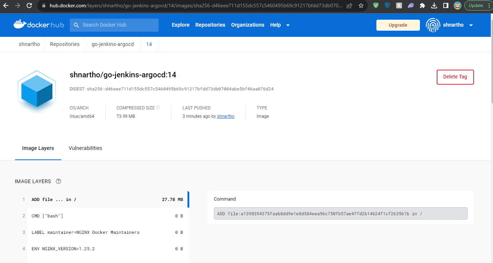

## A website built with Go, server by nginx, backed by a Jenkins and ArgoCD-managed CI/CD pipeline.✌️

### 🔰 Overview 

#### 🟢 The website is running in localhost. To update and push the changes in the server, I have Jenkins for CI and argoCD for CD.

#### 🟢 Here I prepared the Jenkins server for CI

#### 🟢 As the CICD configured, updating code and pushing code to repo will trigger the webhook.

#### 🟢 As soon as the code repo updated, jenkins job will start executing, pull repo, build docker image, push image to docker with new build number and also update the deployment.yaml file in deployment github repository which argoCD will use for kubernetes deployment. 

#### 🟢 Docker images pushed to dockerhub.

#### 🟢 The deployment.yaml file in deployment repository also got updated by jenkins.

#### 🟢 As soon as deployment.yaml file got updated, argoCD will sync, pull image from dockerhub and deploy new updated container based on the image build number. 

#### 🟢 Therefore, we have achieved complete automated CI/CD software delivery. 

### 🖥️ Servers Setup 
1. EC2: To connect using aws ec2 instances, first check if "etc/ssh/sshd_config -> PasswordAuthentication yes", incase it is set to no then change it to yes otherwise using putty you cant connet to the ec2 instances. 
2. Jenkins: Install java runtime environment. For Jenkins installing follow https://www.jenkins.io/doc/book/installing/linux/. 
3. ArgoCD: For argocd installation follow 

🎯 In summary, Updating code and pushing it to git repository will trigger the webhook, jenkins will pull the updated code repo in the project workspace and execute necessary shell comands for port and running the website.

### 🖥️ Error Hanlidng
1. Css and static files were not being served. Solution: Make sure to get and set working directory is the executables directory and then use relative path in your code. (os.Chdir(exeDir), templates/index.html, static/styles.css etc)
2. Jenkins issues: sudo usermod -aG docker $username, for example "sudo usermod -aG docker jenkins" and "newgrp docker". And reboot the server. so jenkins will be able to access docker comands. Use t2.small, the t2.micro stuck in the dokcer build stage.

